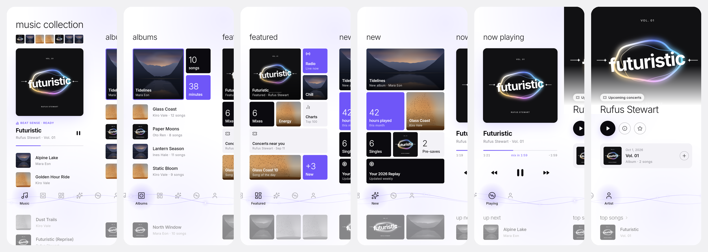

# Music Sense

A free music player with an interface that mixes the PlayStation XMB and the
Windows Metro style. Its signature feature, Beat Sense, will mix each song
into the next with matched beats.

The product spec (features, Beat Sense algorithm, sources, AI features and
roadmap) is in the shared spec doc.



## Status

Android first. What's in the app now:

- **The six screens from the design**, wired to real music, with the same
  layout and navigation: Metro panorama pages, and the XMB icon bar sliding
  with each swipe.
- **Beat Sense**, the automatic mixing engine (`lib/beat_sense/`):
  - *Analysis:* tempo, beat grid, bars, 8-bar phrases, musical key (Camelot),
    loudness, energy, and where the intro and outro are. It's plain Dart,
    runs in a background isolate and is cached per song.
  - *Planning:* picks the next song by tempo, key, energy and taste, and plans
    the transition. It starts on a phrase boundary and enters long intros
    part-way, so the drop lands as the blend ends. It matches tempo within
    ±8% (half and double time count as the same tempo) and evens out
    loudness. Transition styles: bass swap, blend, cut on the beat, or a
    plain crossfade when a song has no steady beat.
  - *Playback (`lib/playback/mix_engine.dart`):* two decks. The incoming song
    starts on the downbeat, a 30 ms conductor drives volume and the bass
    swap, speed is nudged to cancel drift, and tempo eases back after the
    mix. When the queue runs out, Beat Sense keeps going with the best-fitting
    related song.
- **Sources** (`lib/sources/`):
  - *Local files:* Android MediaStore, with covers and audio decoding in
    `MediaBridge.kt`.
  - *YouTube Music:* optional plugin with home feed, charts, search and radio
    through YouTube Music's unofficial API, and streams via youtube_explode.
    Build without it with `--dart-define=YT_MUSIC=false`.
- **Polish, in PlayStation style:**
  - the page glow, the XMB waves and the shadows take their colour from the
    current cover
  - the waves swell on the beat, with sparkles drifting along them
  - a light sweep crosses covers, the covers "breathe" with the beat, and
    motes of light rise off the Playing cover
  - the artist backdrop slowly zooms
  - haptic ticks as each icon snaps into the slot
- Background playback, notification and lock-screen controls (audio_service).

The web build and the tests run on the design's sample songs with a silent
clock; real playback needs an Android device.

### Not verified yet

These need a real device and network access this project's build
environment didn't have:
- the APK build
- audio playback and mixing on a phone
- YouTube Music against live YouTube

The Kotlin is type-checked against Android 15 APIs with
`tool/check_android_kotlin.sh`. Because YouTube Music uses an unofficial API,
expect it to need occasional fixes when YouTube changes it.

## Run

Requires Flutter 3.47 or newer.

```sh
flutter pub get
flutter run                                  # Android phone, or Chrome for the preview
flutter build apk --release                  # GitHub build, with YouTube Music
flutter build appbundle --dart-define=YT_MUSIC=false   # Play Store build
flutter test                                 # 36 tests: analysis, planner, parser, UI
```

## Layout

```
lib/
  beat_sense/          analysis (FFT, tempo, beats, key) and planning
  playback/            mix engine, decks, analysis cache, demo player, media session
  sources/             local files, YouTube Music plugin, samples
  library/             models, library aggregation, listening stats
  pages/               the six pages
  widgets/             XMB bar, panorama page, tiles, artwork, ambient effects
  shell.dart           panorama + XMB bar, swipe physics, haptics, keyboard
android/.../MediaBridge.kt   MediaStore, covers, audio decoding for analysis
```

Fonts: [Inter](https://rsms.me/inter/) (SIL Open Font License, see
`assets/fonts/LICENSE.txt`). Icons: [Lucide](https://lucide.dev).
